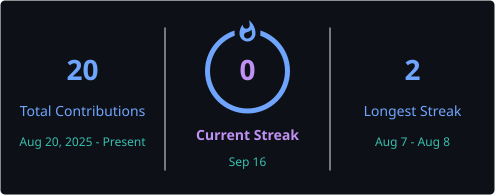

<div align="center">


<a href="https://www.linkedin.com/in/joaopaulodlimaaa" target="_blank">
  
</a>

<br><br>

<a href="https://www.linkedin.com/in/joaopaulodlimaaa" target="_blank"></a>
<a href="https://github.com/joaopaulo-devv" target="_blank"></a>


</div>

<br>

## 👋 Sobre mim

```bash
$ whoami
> João Paulo — João Pessoa/PB
> full stack dev com queda por achar o que não deveria estar exposto
> café: obrigatório · escopo autorizado: sempre
```

Sou autodidata em segurança ofensiva e desenvolvimento Full Stack, buscando oportunidades em **Pentest / AppSec / Segurança Ofensiva**. Estudo por conta própria desde cedo e já apliquei isso na prática: passei um período caçando falhas de segurança reais nos sistemas de uma grande plataforma de cursos EAD, usando principalmente Burp Suite, encontrando desde falhas de controle de acesso (IDOR) até problemas de configuração (CORS, headers, DMARC).

Uso minha base como desenvolvedor — banco de dados, API, autenticação, front-end — pra entender *por que* uma falha existe, não só rodar uma ferramenta e reportar o resultado.

> **construo pensando em como vou quebrar, e quebro pensando em como corrigir.**

<br>

## 🕵️ Áreas de atuação em segurança

<table width="100%">
<tr>
<td width="50%" valign="top">

**🔓 Web Application Security**
- Testes de autenticação (OTP, sessão, 2FA)
- IDOR / Broken Access Control
- CORS mal configurado
- Falhas de lógica de negócio
- Rate limiting / força bruta

</td>
<td width="50%" valign="top">

**🌐 Recon & Infraestrutura**
- Enumeração e varredura de portas (Nmap)
- Análise de headers de segurança HTTP
- Testes de injeção (SQLi, XSS)
- Avaliação de CDN e exposição de conteúdo

</td>
</tr>
</table>

Metodologia baseada no **OWASP Top 10** e no **OWASP Testing Guide**, com relatórios técnicos priorizados por severidade e impacto de negócio — sempre dentro de escopo autorizado.

<br>

## 📜 Certificações

<p align="left">
  
</p>

<br>

## 🛠️ Tecnologias & Ferramentas

**Segurança**

<p align="left">
  
  
  
  
  
  
  
  
</p>

**Desenvolvimento**

<p align="left">
  
  
  
  
  
  
  
  
  
</p>

<br>

## 📌 Projetos em destaque

### 🛡️ [secure-auth-app](https://github.com/joaopaulo-devv/secure-auth-app)

Aplicação Full Stack (Node/Express/MySQL/React) construída com **autenticação segura como requisito de design**, não como reboco depois — mitigações pensadas desde o início para IDOR, força bruta e enumeração de usuários.

O lado "construção" do mesmo raciocínio usado nos pentests abaixo: se eu sei como uma falha é explorada, sei também como evitar que ela exista.

<p align="left">
  <a href="https://github.com/joaopaulo-devv/secure-auth-app"></a>
  <a href="https://github.com/joaopaulo-devv/secure-auth-app"></a>
</p>

<br>

### 🕵️ [pentest-ead-writeup](https://github.com/joaopaulo-devv/pentest-ead-writeup)

Writeup anonimizado de um teste de invasão **autorizado** em uma plataforma de cursos online, conduzido em 3 fases:

| Fase | Escopo | Principais achados |
|:---:|---|---|
| **1** | Sem autenticação | CORS malconfigurado, enumeração de usuários, rate limiting ausente |
| **2** | Conta autenticada | Vídeos pagos sem autenticação (CDN), CORS permissivo, sessão sem controle de concorrência |
| **3** | Testes avançados | IDOR em sistema de gamificação, bruteforce de OTP, headers de segurança ausentes |

Inclui relatórios técnicos por fase e um **guia de correção consolidado**, priorizado por severidade — como seria entregue de fato a um time de desenvolvimento.

<p align="left">
  <a href="https://github.com/joaopaulo-devv/pentest-ead-writeup"></a>
  <a href="https://github.com/joaopaulo-devv/pentest-ead-writeup"></a>
</p>

<br>

## 🎓 Em estudo

<p align="left">
  
  
  
  
</p>

<br>

## 📊 Estatísticas do GitHub

<p align="center">
  
  
</p>

<p align="center">
  
</p>

<br>

<div align="center">
  
</div>

<br>


## 📫 Contato

<p align="center">
  <a href="https://www.linkedin.com/in/joaopaulodlimaaa" target="_blank"></a>
  <a href="https://github.com/joaopaulo-devv" target="_blank"></a>
</p>

<p align="center">
  
</p>


